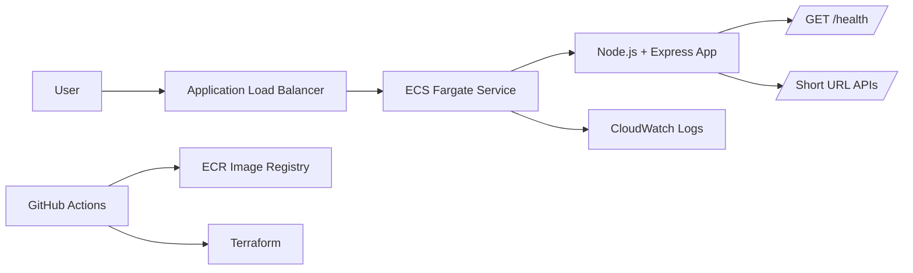

# Architecture

```mermaid
flowchart LR
  User --> ALB[Application Load Balancer]
  ALB --> ECS[ECS Fargate Service]
  ECS --> App[Node.js + Express App]
  App --> Health[/GET /health/]
  App --> URLs[/Short URL APIs/]
  ECS --> CW[CloudWatch Logs]
  GH[GitHub Actions] --> ECR[ECR Image Registry]
  GH --> Terraform[Terraform]
```
