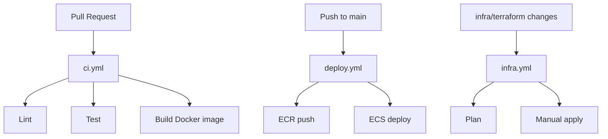

# CI/CD Flow

```mermaid
flowchart TD
  PR[Pull Request] --> CI[ci.yml]
  CI --> Lint[Lint]
  CI --> Test[Test]
  CI --> Docker[Build Docker image]
  PushMain[Push to main] --> Deploy[deploy.yml]
  Deploy --> ECR[ECR push]
  Deploy --> ECS[ECS deploy]
  Infra[infra/terraform changes] --> TF[infra.yml]
  TF --> Plan[Plan]
  TF --> Apply[Manual apply]
```
